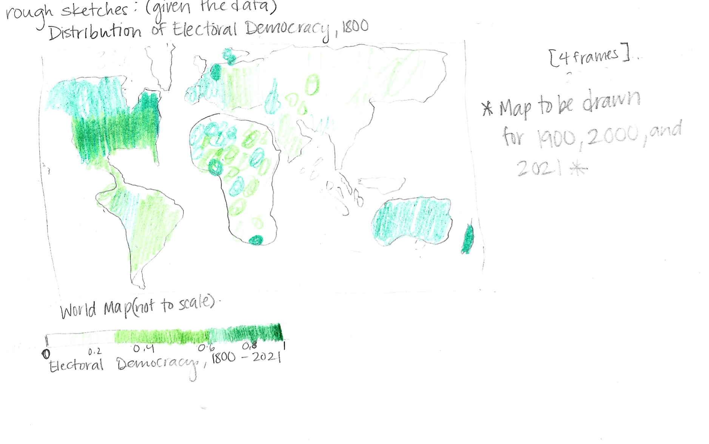

# Critique by Design
## In this assignment, we were asked to critique an existing data visualization and redesign it using user input and our own intuition to determine what a better data visualization could look like.

### Part One: Finding a Visualization
It took some time, but I eventually came across this data visualization from Our World In Data:
<iframe src="https://ourworldindata.org/grapher/distribution-electoral-democracy-vdem?time=1900&country=~OWID_HSE" loading="lazy" style="width: 100%; height: 600px; border: 0px none;"></iframe> 

### Part Two: Critique the Data Visualization
I think this is an incredibly intricate data visualization, with a lot of moving parts (literally). However, in trying to convey so much data to its audience, this visualization can get a bit convoluted as the user tries to track so much information over a 232 year period, in which some countries do not exist yet or anymore. Assigning each region (continent) a color allows for the user to have more geographic context, but it is still difficult to follow over time -- especially as the bars move over time, when dragging the time timeline cursor. The same message could be conveyed with fewer frames and less color.

Organizing the bars from most to least democratic aids the visual, but it's still difficult to compare. The great part about the tools that they embed into the visual is that you can choose to select countries; however, it still felt like the geographic aspect was missing. If the audience is well-versed in geography, then this visualization is entirely useful. Additionally, if they are more concerned with a count of how many countries fall into a range, without concern about visually locating the countries, this visualization is still incredibly useful. But what about expanding the audience beyond these groups? This question is what prompted me to to take the following steps to redesign the visualization.

### Part Three: Sketch Out A Visualization
#### My solution was a choropleth map that would allow the user to absorb the same information over four frames: 1800, 1900, 2000, and 2021 (most current data).

Sketch:

To me, this was would convey a similar message over longer intervals of time, bringing the audience to the most recent data in 2021. The map allowed me to *see* exactly where a country is in terms of democracy index and location in comparison to another country. I initially chose green because it seemed to not have any particular sort of political connotation.

### Part Four: Testing the Solution

#### In speaking with two different class mates, I asked them what their thoughts were on the sketch, given zero context. I used the following questions:

1. Can you tell me what you think this is?

      Both classmates alluded to the fact that the map was of electoral democracy, and that the lighter green countries were less democratic than the                         
      darker green countries.

2. Can you describe to me what this is telling you?

      General answer: The Distribution of Electoral Democracy over time.

3. Is there anything you find surprising or confusing?

      Not really.

      The colors of certain countries that I may not have known were or were not as democratic as I thought they would be.

4. Who do you think is the intended audience for this?

      Someone who is interested in politics or history. Potentially students.
      
      Researchers.

5. Is there anything you would change or do differently?

      Green reminds me of **money**, maybe try another color. Blue? Purple?
      
      The green made me think GDP for a second.

### Part Five: Final Redesign

In choosing four frames, I think the same idea of change over time could be conveyed, and the audience is able to browse the geography will retaining the same information. I switched the indix indicator color to blue given the feedback, and I did my best to keep things as simple as possible. Overall, I think this is more appealing way to compare in a solid color gradient as opposed to the rainbow effect happenin in the bar graph. 

In truth, it would be more optimal to have the maps side by side or even presented in a quadrant formation, in order to allow less eye travel. Also, the highlight feature of the original design is a feature that would be just as useful on these visualizations. 
