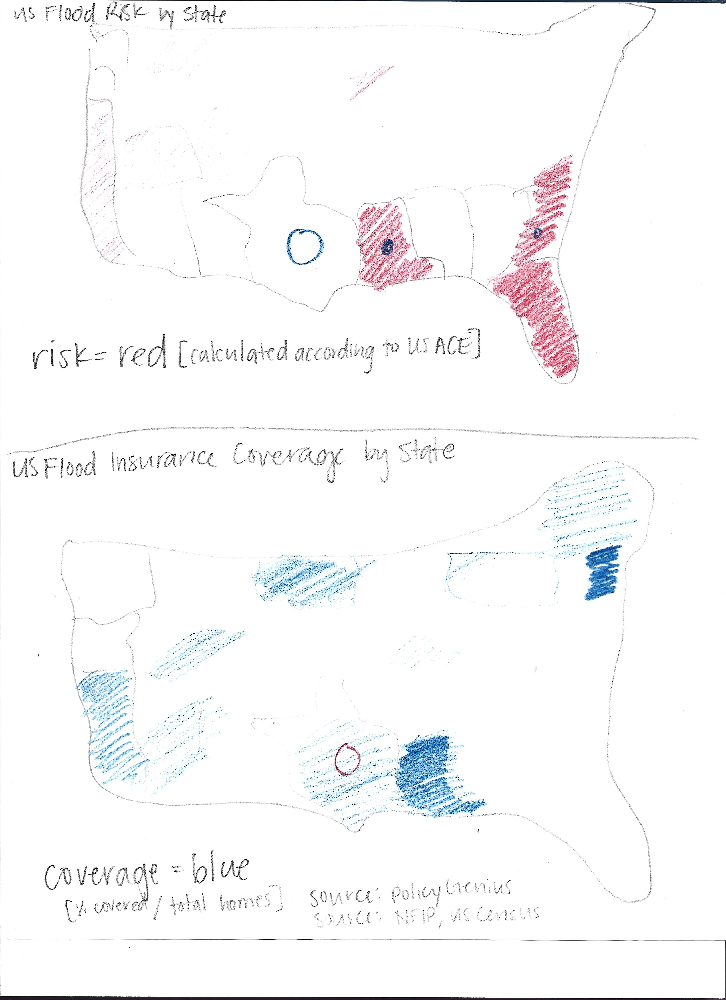

# The Water Is Rising
## How insurance factors into planning for flood-risk associated with climate change 

### High Level Summary

"__Twenty-five percent__ of flood claims occur to homes __outside of high-risk areas__," and this number is only expected to rise as cities begin mitigating climate change. Water is a major factor in going forward. The federal safety-net, the National Flood Insurance Program (NFIP), covers 95% od flood insurance policies, leaving only 5% to private insurance companies. While the federal program has a high participation rate of those that currently have insurance, the underlying issue is that only __ten percent of homeowners__ have NFIP flood insurance nation wide. For this reason, greater awareness about protecting people's families and their dwellings from the threat that flooding poses, even where it is unexpected.

This project will focus on emphasizing the numbers that close the gap in states that are not necessarily known for their proximity to water, yet where scientists have identified potential flood risk in the future. I want the audience to takeaway that there are safety nets in place that they can lean into and not shy away from as planning becomes more necessary given the challenges facing our society. Often the message is that "climate change is scary," and in truth, it is. However, presenting people with tangible ways to be resilient to the risks that climate change poses seems like a more productive way to focus efforts.

### Sketches

Choropleth Maps that would show the risk according to both Flood Risk and insurance Coverage according to each states' data. The maps would be aimed at showing where the dots should be just as big as the states pigment; however, where those two are not aligned, therein presents the issue.

additional idea -- bar graphs: Organized from high to low risk states right next to high to low coverage states; given the data, the overlap is not as large as one might suspect.

### Data

